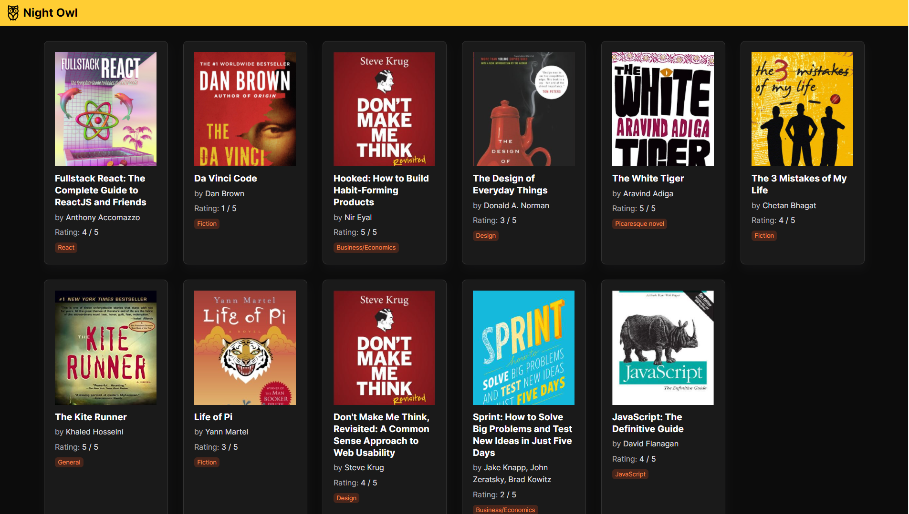

# ws-aern-stack-12-13-aug
This repo contains the source code for the Workshop done at MF IDC on 12th and 13th Aug 2021.

## Topics Covered
- Database
- API design & Development
- User Interface development
- CSS

## Technologies
- Node.js
- Express
- React
- CSS

# Screen designed and developed

## List Page

  

  

## Details Page

  

  
